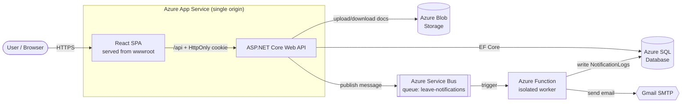

# LeavePortal

**Enterprise-style Employee Leave Management System** — built with .NET 10 (Clean Architecture), React + TypeScript, and a set of connected Azure services.

Employees apply for leave (with optional document uploads); managers approve or reject; everyone gets email notifications through an asynchronous, decoupled pipeline. The whole stack is deployed to Azure and served from a single origin.

> 🔗 **Live demo:** `https://leaveportal-api-deh7adc4b3cxddc6.centralindia-01.azurewebsites.net`
> _(Demo credentials available on request. The free-tier database/app may cold-start on the first request — give it ~15s.)_

---

## Features

**Employee**
- Register / login (JWT issued as a secure **HttpOnly cookie**)
- Apply for leave — leave type, date range, reason, **optional document upload** (Azure Blob Storage)
- View personal leave history with live status
- Leave-balance tracking (total / used / remaining per type per year)

**Manager**
- Dedicated manager dashboard (role-based routing)
- Review a queue of pending requests across the team
- **Approve / reject** with a comment; balance is deducted on approval
- Employees are notified by email of the decision

**System**
- Asynchronous email notifications (never block the API)
- Full audit log of every notification (sent / failed)

---

## Tech Stack

| Layer | Technology |
|---|---|
| **Frontend** | React + TypeScript (Vite), React Router, TanStack Query (server state), Zustand (auth state), Bootstrap |
| **Backend** | ASP.NET Core Web API (.NET 10), Clean Architecture (API / Core / Infrastructure / Functions), service layer, EF Core (Database-First) |
| **Auth** | JWT via HttpOnly cookie, role-based authorization (Employee / Manager) |
| **Database** | Azure SQL Database |
| **Messaging** | Azure Service Bus (queue) |
| **Serverless** | Azure Functions (isolated worker) — email sender |
| **Storage** | Azure Blob Storage (leave documents) |
| **Email** | Gmail SMTP via MailKit |
| **Hosting** | Azure App Service (API + SPA, single origin) + Azure Functions |

---

## Architecture



**Why async notifications?** The API never calls "send email" directly. It drops a message on Service Bus and returns immediately, so a slow or down email provider can never hang the API. The Function consumes the queue independently, sends the email, and records the outcome.

---

## Key Engineering Decisions

- **HttpOnly cookie for JWT (not localStorage)** — the token is invisible to JavaScript, protecting it from XSS. The browser attaches it automatically.
- **Single-origin deployment** — the React build is served from the API's `wwwroot`, so the frontend and API share one domain. This keeps the auth cookie first-party (no fragile cross-site cookies) and matches how enterprises host cookie-auth apps.
- **Async, decoupled notifications** — Service Bus + Azure Function so email delivery is isolated from the request path.
- **Clean Architecture + service layer** — controllers → services → EF Core; `Core` has no external dependencies. (Originally built on MediatR/CQRS + FluentValidation, then deliberately refactored to a service layer + DataAnnotations for simplicity — a judgment call, documented in the tech doc.)
- **Database-First EF Core** — schema is the source of truth; entities are scaffolded from Azure SQL (mirrors how teams with DBAs / Flyway-style migrations work).
- **Config as environment variables in the cloud** — secrets live in user-secrets / gitignored files locally, and as App Service environment variables in Azure — never in source control.

---

## Project Structure

```
LeavePortal/
├── backend/
│   ├── LeavePortal.API/            # Controllers, Program.cs, serves the SPA
│   ├── LeavePortal.Core/           # Interfaces, DTOs, domain enums (no external deps)
│   ├── LeavePortal.Infrastructure/ # EF Core DbContext, services, Blob + Service Bus
│   └── LeavePortal.Functions/      # Azure Function — email sender
├── frontend/                       # React + TypeScript (Vite)
└── docs/                           # TechDoc + DatabaseSchema (full design notes)
```

---

## Running Locally

**Prerequisites:** .NET 10 SDK, Node.js 18+, an Azure SQL database (or SQL Server), and Azure Service Bus / Blob Storage connection strings.

**Backend**
```bash
cd backend/LeavePortal.API
# set secrets (connection string, JWT key, Service Bus, Blob) via user-secrets
dotnet run
# API + Swagger at https://localhost:7147/swagger
```

**Frontend**
```bash
cd frontend
npm install
npm run dev
# app at http://localhost:5173  (calls the local API via .env.development)
```

**Build for single-origin deploy**
```bash
cd frontend
npm run build                       # outputs to frontend/dist (uses .env.production -> /api)
# copy frontend/dist/* into backend/LeavePortal.API/wwwroot/, then publish the API
```

---

## Documentation

Full design notes, decisions, and the day-by-day build log live in [`docs/LeavePortal_TechDoc.md`](docs/LeavePortal_TechDoc.md), and the schema in [`docs/LeavePortal_DatabaseSchema.md`](docs/LeavePortal_DatabaseSchema.md).
